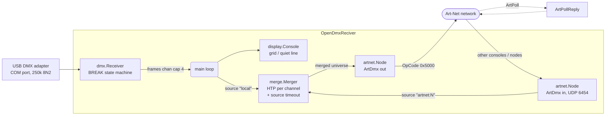

# OpenDmxReciverToArtnet

A small Windows console tool that **receives** DMX512 from a USB→DMX adapter, shows a live channel grid in the terminal, and can rebroadcast the universe as **Art-Net** — optionally HTP-merging other incoming Art-Net universes into the output.

Written in Go with a single dependency (`golang.org/x/sys`). Go module path: `github.com/mc-ha/OpenDmxReciver`.

```
Opening COM3 at 250000 baud (8N2)...
Port opened successfully.
Art-Net output enabled: universe 0 -> 192.168.1.255

DMX Universe 1 | 512 channels | 43.8 fps | Frame #1247
----------------------------------------------------------------------
       001 002 003 004 005 006 007 008 009 010 011 012 013 014 015 016
001:   255 128 000 000 064 000 000 000 000 000 000 000 000 000 000 000
017:   000 000 000 000 000 000 000 000 000 000 000 000 000 000 000 000
...
```

---

## Hardware

Developed and tested against this adapter:

**[DSD TECH SH-RS09B USB to DMX cable](https://www.amazon.de/dp/B07WV6P5W6)** — Amazon.de, ASIN `B07WV6P5W6`

> **Important:** this is a *receive* application. Many cheap FTDI-based "Open DMX USB" cables are **transmit-only** and will never deliver a single byte to this tool no matter how the wiring is done. The unit linked above works for RX.

The port is opened read-only as `\\.\COMx` at **250000 baud, 8 data bits, no parity, 2 stop bits (8N2)** — the DMX512 line settings. Find the COM port number in **Device Manager → Ports (COM & LPT)**.

## Requirements

- **Windows only.** Serial I/O is done with direct `kernel32.dll` syscalls ([dmx/serial.go](dmx/serial.go)) and the console output uses Windows VT escape sequences ([display/console.go](display/console.go)). This will not build or run on Linux/macOS without porting.
- Go **1.26.1** or newer to build.
- Dependency: `golang.org/x/sys v0.42.0` (only).

## Build

```bash
go build -o OpenDmxReciver.exe .
```

## Quick start

```bash
# Full channel grid on COM3
OpenDmxReciver.exe COM3

# Just a status + FPS line
OpenDmxReciver.exe -quiet COM3

# Forward the incoming DMX to Art-Net universe 0 on the local broadcast address
OpenDmxReciver.exe -artnet -artnet-dest 192.168.1.255 -artnet-universe 0 COM3

# Also merge incoming Art-Net universes 1 and 2 into output universe 0 (HTP)
OpenDmxReciver.exe -artnet -merge-inputs 1:0,2:0 COM3
```

## How it works



The DMX receiver, the display loop and the Art-Net listener each run as goroutines; frames flow through a buffered channel (capacity 4, non-blocking send — frames are dropped rather than stalling the reader). Shutdown is coordinated with `context.Context` cancellation on Ctrl+C.

## CLI flags

```
Usage: OpenDmxReciver.exe [flags] <COM port>
```

| Flag | Default | Description |
| --- | --- | --- |
| `-channels` | `512` | number of DMX channels to display (1-512) |
| `-no-break-detect` | `false` | fallback mode: use read timeouts instead of BREAK detection |
| `-quiet` | `false` | show only receive status and FPS changes instead of full channel grid |
| `-artnet` | `false` | enable Art-Net output |
| `-artnet-dest` | `255.255.255.255` | Art-Net destination IP (broadcast or unicast) |
| `-artnet-universe` | `0` | Art-Net universe number (0-32767) |
| `-artnet-bind` | *(auto-detect)* | local IP to bind for Art-Net |
| `-merge-inputs` | *(empty)* | Art-Net merge inputs as `source:output` pairs (e.g. `1:0,2:0`) |
| `-merge-timeout` | `5` | timeout in seconds for Art-Net merge sources (0 = persist forever) |
| `-debug-artnet` | `false` | enable verbose Art-Net receive logging |

The COM port is the first positional argument. If omitted, `comPort` from `settings.properties` is used; if that is empty too, usage is printed and the program exits.

CLI flags override the values from `settings.properties`. The one exception is `-merge-inputs`, which only overrides the file when it is non-empty ([main.go:58-61](main.go#L58-L61)) — so a config-file merge setup stays active unless you explicitly pass the flag.

## Configuration — `settings.properties`

On first run, if no `settings.properties` exists **next to the executable** (not the current working directory), a commented template is generated there and the path is printed. The file is Java-style `key=value`, `#` starts a comment, blank lines are ignored. It is gitignored.

```properties
# OpenDmxReciver Settings
# Lines starting with # are comments. Blank lines are ignored.
# CLI flags override values set here.

# COM port for the Open DMX USB adapter (e.g., COM3)
comPort=

# Number of DMX channels to display (1-512)
channels=512

# Fallback mode: use read timeouts instead of BREAK detection (true/false)
noBreakDetect=false

# Quiet mode: show only receive status and FPS changes instead of full channel grid (true/false)
quiet=false

# Enable Art-Net output (true/false)
artnet=false

# Art-Net destination IP (broadcast or unicast)
artnetDest=255.255.255.255

# Art-Net universe number (0-32767)
artnetUniverse=0

# Local IP to bind for Art-Net (leave empty for auto-detect)
artnetBind=

# Merge Art-Net inputs: sourceUniverse:outputUniverse (comma-separated)
# Received Art-Net data is HTP-merged per output universe.
# Example: mergeInputs=1:0,2:0  (merge universes 1 and 2 into output 0)
mergeInputs=

# Timeout in seconds for Art-Net merge sources (0 = persist forever)
mergeTimeout=5
```

Booleans must be the literal string `true` to be enabled. An unparsable integer prints a warning and falls back to the default.

## Art-Net

- UDP port **6454**, ArtDmx `OpCode 0x5000`, protocol version 14.
- The node always binds `0.0.0.0:6454` so that broadcast packets are received. If the port is already in use it retries on an ephemeral port and warns — in that case ArtPoll discovery will not work, but output still does.
- `-artnet-bind` does **not** change the bind address; it sets the local IP reported in the ArtPollReply and used for loopback filtering. Left empty, the local IP is auto-detected by probing a route toward the destination.
- **ArtPoll** requests are answered with an ArtPollReply (unicast back to the sender) advertising one input port, short name `OpenDmxReciver`, long name `OpenDmxReciver Art-Net Node`.
- The universe number is the flat 15-bit Port-Address (0–32767); it is split into the SubUni and Net bytes on the wire, so there are no separate net/subnet options.
- Every ArtDmx packet is a fixed 530 bytes — an 18-byte header plus a full 512 channels, zero-padded — regardless of how many channels the source actually sent.
- The sequence field increments per packet and wraps `0 → 1` (0 means "sequencing disabled" in the spec).

## Merging other Art-Net universes

`-merge-inputs 1:0,2:0` (or `mergeInputs=1:0,2:0` in the config) combines other Art-Net sources with the locally received DMX:

- The DMX coming in over USB is registered as source `local` on the universe given by `-artnet-universe`.
- Each `source:output` pair registers an Art-Net source `artnet:<source>` feeding output universe `<output>`.
- All sources mapped to the same output universe are merged **HTP — highest takes precedence, per channel**. The merged universe is then sent out as ArtDmx.
- Incoming ArtDmx on a universe that is *not* listed as a source is discarded, and the tool's own output universes are filtered out by source IP so it never merges with itself.
- A source that stops sending for `-merge-timeout` seconds is considered gone: its contribution is zeroed, the universe is recomputed, and a `disconnected (timeout)` line is printed. `-merge-timeout 0` keeps sources forever.

Connect/disconnect events are printed as they happen:

```
 | Art-Net merge: universe 1 -> output universe 0 (HTP)
 | Art-Net merge: source artnet:1 connected
 | Art-Net merge: source artnet:1 disconnected (timeout)
```

## Display modes

**Default (grid):** the screen is redrawn each frame with a header (`channels | fps | frame #`), a 16-column value grid with `001:`-style row labels, and non-zero values highlighted in yellow. `-channels` limits how many channels are drawn.

**Quiet (`-quiet`):** a single self-rewriting status line, only re-printed when the FPS changes by 1 or more:

```
DMX Receiving | 44.0 fps | 512 channels
```

**No-data watchdog:** if no frame arrives, a warning is shown after 10 seconds and then every 30 seconds after that.

## Frame detection modes

**BREAK detection (default)** uses overlapped I/O and `WaitCommEvent` to catch the DMX BREAK, then validates the `0x00` start code and reads the channel data. This is the accurate mode and requires an adapter that reports break events.

**Fallback (`-no-break-detect`)** has no break events available and instead treats read-timeout gaps (>1 ms with no bytes) as frame boundaries. Try this if the adapter delivers data but no frames are ever assembled.

## Troubleshooting

**Port will not open** — check that the adapter is plugged in, that the COM port number matches Device Manager, and that no other application (lighting software, a terminal) is holding the port open. The port is opened without sharing.

**Port opens but no data after 10 seconds** — the most likely cause is a transmit-only adapter (see [Hardware](#hardware)). Otherwise check that something is actually sending DMX, check the XLR wiring, and try `-no-break-detect`.

**`Art-Net: port 6454 in use`** — another Art-Net application (or a second instance of this tool) already owns the port. Output still works from the ephemeral port it fell back to, but the node will not answer ArtPoll discovery.

**Merged universes never appear** — the source universe must be listed in `-merge-inputs`; anything else is dropped on receive. Use `-debug-artnet` to see what is actually arriving.

## Tests

```bash
go test ./...
```

52 tests cover `artnet/`, `config/` and `merge/`. `dmx/` and `display/` are not covered — they are thin wrappers over Windows syscalls.

> Known failure: `TestDecodeArtDmxRoundTrip` still asserts that a 256-channel frame round-trips with `Length == 256`, but `EncodeArtDmx` now always emits a full 512-channel packet, so it decodes back as 512. The test needs updating to match the fixed-length behaviour.

## License

MIT — see [LICENSE](LICENSE). Copyright © 2026 Andreas Thomsen.
